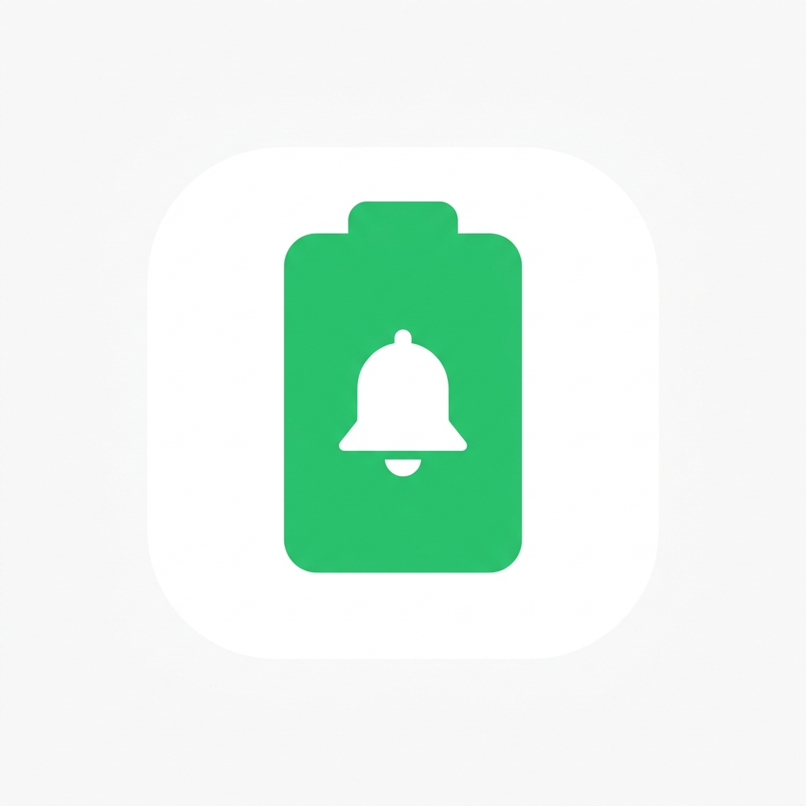

# 🔋 Battery Charge Alarm



A modern, open-source Android application designed to keep your phone's battery healthy and prevent overcharging. Battery Charge Alarm runs silently in the background, consuming zero idle battery, and intelligently alerts you when your device reaches specific battery milestones.

## 📥 Download

**[Download the latest APK here](https://github.com/0xrohitsen/BatteryChargeAlarm/releases)**

## ✨ Features

- **Intelligent Percentage Alarms:** Set specific battery milestones (20%, 30%, ..., 100%). The app plays an audio alarm right when the battery hits that percentage.
- **Aggressive 100% Full Charge Loop:** Automatically prevents you from leaving your device plugged in at 100%. The alarm will play continuously until the charger is removed!
- **Custom Audio Support:** Use the bundled voice prompts or select any custom `.mp3` audio from your device's storage.
- **Master Kill Switch:** Instantly disable or enable the entire alarm system from the beautiful Home Dashboard.
- **Zero Idle Battery Drain:** Fully optimized background service. The app completely goes to sleep when the charger is disconnected, using exactly 0% battery while you go about your day.
- **Resilient Background Service:** Survives being swiped away from the Recent Apps list (Supports Android 14 and 15 background service limits).
- **Auto-Start on Boot:** Automatically monitors your battery if the phone boots up while connected to a charger.

## 🛠️ Technology Stack

Built natively for modern Android development:
- **Kotlin:** 100% Kotlin codebase.
- **Jetpack Compose:** Fully declarative, beautiful Material 3 UI.
- **MVVM Architecture:** Clean separation of concerns with ViewModels.
- **Jetpack DataStore:** Robust, type-safe local storage for user preferences.
- **Coroutines & Flows:** Fully asynchronous audio playing and data observing.
- **Foreground Services:** Reliable background execution via `FOREGROUND_SERVICE_SPECIAL_USE`.

## 🚀 Getting Started (Developers)

To run this project locally, simply clone the repository and open it in Android Studio.

```bash
git clone https://github.com/0xrohitsen/BatteryChargeAlarm.git
```
1. Open the project in **Android Studio**.
2. Wait for Gradle to sync the dependencies.
3. Click **Run** to install the app on your emulator or physical device.

## 🤝 Contributing
Contributions, issues, and feature requests are welcome! Feel free to check the issues page if you want to contribute.

## 📝 License
This project is open-source and available under the [MIT License](LICENSE).
