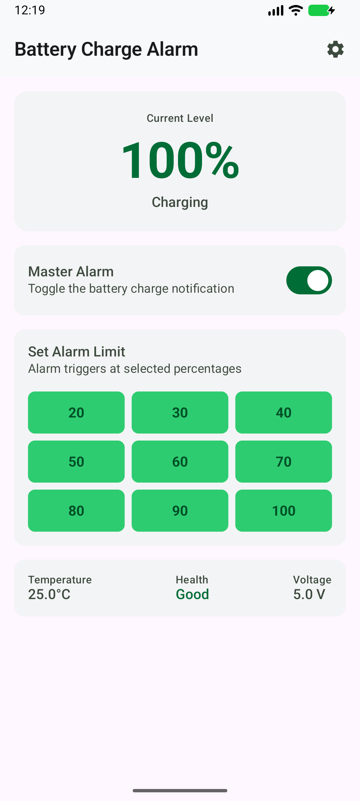
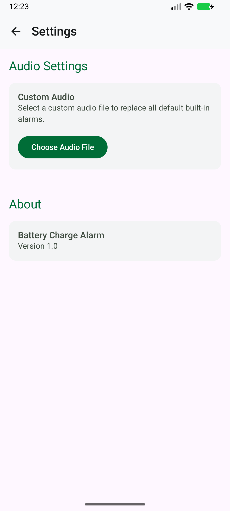

<p align="center">
  
  <h1 align="center">🔋 Battery Charge Alarm</h1>
  <p align="center">
    <strong>A pristine, open-source Android app to keep your battery healthy.</strong>
  </p>
</p>

<p align="center">
  <a href="https://github.com/0xrohitsen/BatteryChargeAlarm/releases/download/v1.0.0/BatteryChargeAlarm.apk">
    
  </a>
</p>

<br>

<p align="center">
  
  &nbsp;&nbsp;&nbsp;&nbsp;
  
</p>

<br>

---

## 🔥 **Core Features**

- ⚡ **Intelligent Percentage Alarms**
  Set targeted battery milestones (20%, 30%, ..., 100%). The app plays an audio alarm *exactly* when the battery hits your chosen percentage.
  
- 🚨 **Aggressive 100% Full Charge Loop**
  **Never overcharge again!** The alarm plays continuously when your battery reaches 100% and will loop endlessly until the charger is unplugged.

- 🎵 **Custom Audio Engine**
  Use the high-quality bundled voice prompts or select **any custom `.mp3` file** right from your device's storage.

- 🛑 **Master Kill Switch**
  Instantly disable or enable the entire alarm system directly from the beautifully designed Home Dashboard.

- 🔋 **Absolute Zero Idle Drain**
  Powered by an optimized background service that **completely sleeps** when the charger is disconnected, consuming **0% battery** during your normal day.

- 🛡️ **Bulletproof Background Service**
  Survives being swiped away from the Recent Apps list! Fully supports the strict Android 14 and 15 background service limitations.

- 🚀 **Auto-Start on Boot**
  Automatically begins monitoring if your phone restarts while plugged into a wall outlet.

---

## 🛠️ **Modern Technology Stack**

This application was engineered using the latest and greatest Android development standards:
- **Language:** 100% Kotlin
- **UI Toolkit:** Jetpack Compose (Material 3)
- **Architecture:** MVVM (Model-View-ViewModel)
- **Storage:** Jetpack DataStore (Type-safe local preferences)
- **Concurrency:** Kotlin Coroutines & Flows
- **System APIs:** `FOREGROUND_SERVICE_SPECIAL_USE` for modern background execution.

---

## 💻 **For Developers: Build it locally**

```bash
git clone https://github.com/0xrohitsen/BatteryChargeAlarm.git
```
1. Open the project inside **Android Studio**.
2. Wait for Gradle to fully sync all dependencies.
3. Click **Run** to install the application on your physical device or emulator.

---

## 🤝 **Contributing**
We love open source! Contributions, issues, and feature requests are highly encouraged. Feel free to open a Pull Request or check the Issues page if you want to contribute.

## 📝 **License**
This project is officially open-source and freely available under the **[MIT License](LICENSE)**.
